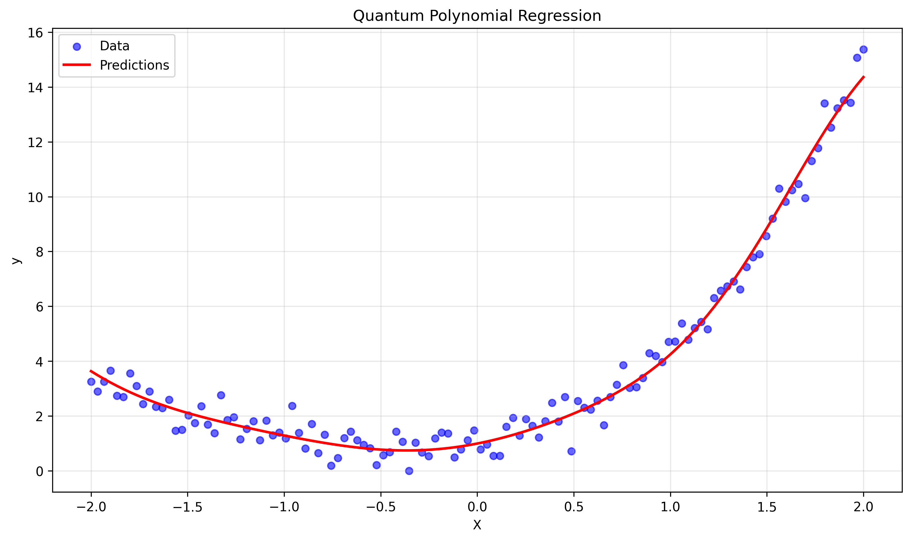

# Quantum Polynomial Regression

A quantum machine learning implementation for polynomial regression using PennyLane and variational quantum circuits (VQCs).

## Overview

This project implements a quantum neural network that learns to approximate polynomial functions using quantum circuits. The model leverages quantum superposition and entanglement to potentially capture complex non-linear relationships in data.

## Features

- **Quantum Circuit Architecture**: Parameterized quantum circuit with rotation gates and entangling layers
- **Data Encoding**: Angle encoding to map classical data into quantum states
- **Variational Training**: Uses gradient-based optimization with quantum parameter shift rules
- **Automatic Scaling**: Built-in data normalization for inputs and targets
- **Performance Metrics**: MSE and R² score evaluation
- **Visualization**: Automatic plotting of results with predictions vs actual data

## Architecture

The quantum circuit consists of:

1. **Data Encoding Layer**: 
   - RY and RZ rotations proportional to input features
   - Hadamard gates for superposition

2. **Variational Layers** (repeated):
   - RX, RY, RZ rotation gates with trainable parameters
   - CNOT gates for entanglement between adjacent qubits
   - Ring connectivity for additional entanglement

3. **Measurement**: 
   - Expectation value of Pauli-Z tensor product on first two qubits

## Installation

```bash
pip install pennylane
pip install scikit-learn
pip install matplotlib
pip install numpy
```

For GPU acceleration (optional):
```bash
# For NVIDIA GPUs (requires CUDA and cuQuantum SDK)
pip install pennylane-lightning-gpu

# Note: lightning.gpu requires NVIDIA CUDA-capable GPUs (SM 7.0/Volta or newer)
# For AMD GPUs, use lightning.kokkos backend instead
# Apple Silicon Macs (M1/M2/M3/M4): No GPU acceleration currently supported
# - PennyLane lightning simulators don't yet support Apple's Metal framework
# - Use the standard lightning.qubit device on macOS
```

## Usage

### Basic Example

```python
import numpy as np
from quantum_regression import QuantumPolynomialRegression

# Generate sample data
X = np.linspace(-2, 2, 100)
y = 0.5 * X**3 + 2 * X**2 + X + 1 + np.random.normal(0, 0.5, len(X))

# Create and train model
model = QuantumPolynomialRegression(n_qbit=6, n_layers=4)
model.fit(X, y, epochs=200)

# Make predictions
predictions = model.predict_new(X)

# Plot results
model.plot_results(X, y)
```

### Custom Configuration

```python
# Create model with custom parameters
model = QuantumPolynomialRegression(
    n_qbit=8,        # Number of qubits
    n_layers=6       # Number of variational layers
)

# Train with custom epochs
model.fit(X, y, epochs=500)
```

## Parameters

### QuantumPolynomialRegression

- `n_qbit` (int, default=6): Number of qubits in the quantum circuit
- `n_layers` (int, default=4): Number of variational layers
- `epochs` (int, default=200): Number of training iterations

### Key Methods

- `fit(X, y, epochs=200)`: Train the quantum model
- `predict_new(X)`: Make predictions on new data
- `plot_results(X, y, save_path)`: Visualize predictions vs actual data

## Performance Considerations

### Quantum Advantage
- **Expressivity**: Quantum circuits can represent complex function mappings
- **Parameter Efficiency**: Exponential Hilbert space with linear parameter growth
- **Entanglement**: Captures non-local correlations in data

### Computational Requirements
- Training time scales with number of qubits and circuit depth
- Classical simulation becomes exponentially expensive for large qubit counts
- Consider using quantum hardware or GPU acceleration for larger models

## Example Output

```
Training...
Epoch 0: Loss = 0.8234
Epoch 50: Loss = 0.3456
Epoch 100: Loss = 0.2103
Epoch 150: Loss = 0.1845
MSE: 0.2847, R²: 0.8923
Plot saved to: quantum_regression.png
```

### Sample Results

The model successfully learns to approximate the cubic polynomial `y = 0.5x³ + 2x² + x + 1` with added noise:



The plot shows the quantum model's predictions (red line) fitting the noisy training data (blue points) across the range x ∈ [-2, 2]. The model captures both the local minimum around x = -0.5 and the overall cubic trend, demonstrating the quantum circuit's ability to learn complex non-linear relationships.

## Technical Details

### Data Preprocessing
- Input features normalized to [0, 1] range
- Target values scaled to [-0.9, 0.9] to match quantum measurement range
- Automatic train/test split (80/20) for evaluation

### Optimization
- Adam optimizer with learning rate 0.08
- Adjoint differentiation method for efficient gradient computation
- Parameter initialization from normal distribution (μ=0, σ=0.05)

### Circuit Design
- Angle encoding: `RY(x * π)` and `RZ(x * π/2)`
- Alternating CNOT pattern for entanglement
- Ring topology for global connectivity

## Extensions

### Potential Improvements
1. **Multi-dimensional Input**: Extend encoding for multiple features
2. **Advanced Ansätze**: Implement hardware-efficient or problem-inspired circuits
3. **Regularization**: Add quantum noise or parameter penalties
4. **Ensemble Methods**: Combine multiple quantum models
5. **Real Hardware**: Deploy on quantum processors (IBM, Rigetti, IonQ)

### Research Applications
- Quantum advantage demonstrations
- Hybrid classical-quantum algorithms
- Quantum feature maps exploration
- Noise resilience studies

## Dependencies

- `pennylane`: Quantum machine learning framework
- `numpy`: Numerical computations
- `scikit-learn`: Classical ML utilities and metrics
- `matplotlib`: Plotting and visualization

## License

This project is open source. Please cite appropriately if used in research.

## References

1. Schuld, M., & Petruccione, F. (2018). *Supervised learning with quantum computers*
2. Biamonte, J., et al. (2017). Quantum machine learning. *Nature*, 549(7671), 195-202
3. PennyLane Documentation: https://pennylane.ai/

## Contributing

Contributions welcome! Areas of interest:
- Performance optimizations
- Alternative quantum encodings
- Hardware deployment scripts
- Benchmarking studies

---

*For questions or issues, please open a GitHub issue or contact the maintainers.*
